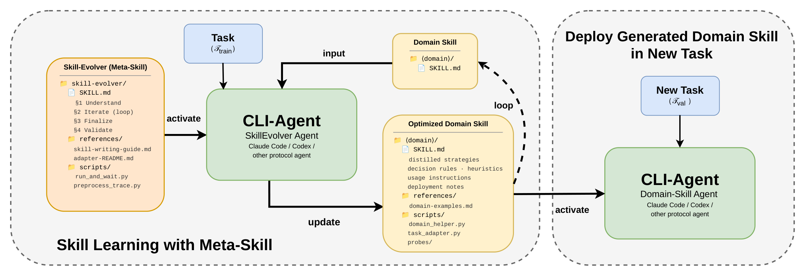
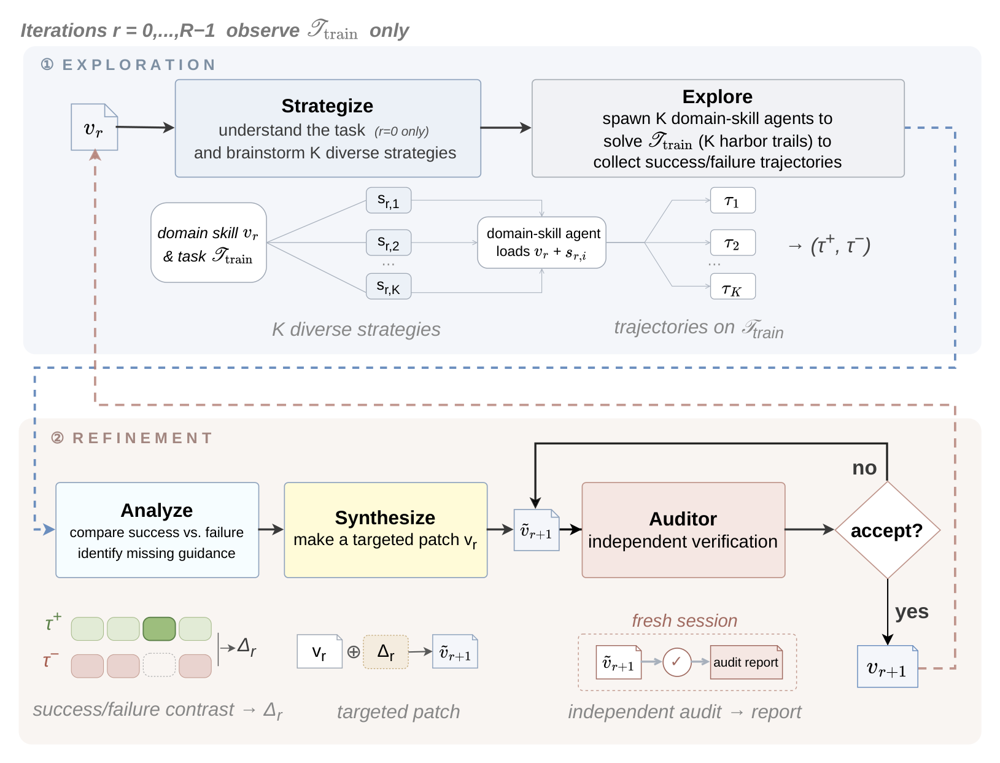

<div align="center">

# SkillEvolver

**A meta-skill that lets a Claude agent author its own reusable skills — from a handful of trials, on demand.**

No fine-tuning. No offline trajectory pool. Just an iterative explore → distill → deploy → refine loop, run end-to-end in a single Agent SDK session.

[](https://www.python.org/)
[](LICENSE)
[](https://www.anthropic.com/)
[](#)

</div>

---

## Headline results

<div align="center">

| Condition | avg@5 on 83 tasks | Δ vs human-curated |
|:---|:---:|:---:|
| No skill                                   | 29.9% | −13.7% |
| Self-generated (one-shot)                  | 32.0% | −11.6% |
| Anthropic skill-creator (subagent-adapted) | 33.9% |  −9.7% |
| Human-curated                              | 43.6% |   —    |
| SkillEvolver (R=1, no refinement)          | 48.2% | **+4.6%** |
| **SkillEvolver (R=2)**                     | **56.9%** | **+13.3%** |

On 74.7% of tasks SkillEvolver ≥ human-curated.
Transfers to continuous-reward tasks: KernelBench (H100) mean speedup **1.16 → 1.51**.
Evolved skills make the downstream agent **−19% tokens · −15% turns · −24% wall-clock**.
End-to-end cost: **~$4/task**.

</div>

---

## What you get

<p align="center">
  
</p>

SkillEvolver is a single `SKILL.md` (a *meta-skill*) that any CLI agent — Claude Code, Codex, or another protocol agent — can activate. The agent reads the meta-skill, runs the loop on a target task, and writes out an **optimized domain skill**: a tight `SKILL.md` plus any helper scripts, references, and probes the loop discovered are worth keeping. That artifact then plugs into a fresh agent session on a new instance of the task — no SkillEvolver needed at deploy time.

## How it works

<p align="center">
  
</p>

Each round `r = 0 … R−1` operates on the training task `τ_train` only:

- 🔍 **Strategize.** The agent brainstorms *K* diverse strategies and writes them as separate domain-skill variants `s_{r,1} … s_{r,K}`.
- 🚀 **Explore.** It spawns *K* downstream agents in parallel Harbor trials, each loading one variant of the current skill `v_r`. Trajectories `τ_1 … τ_K` come back with reward signals `(r⁺, r⁻)`.
- 🔬 **Analyze.** The success vs failure contrast → `Δ_r`: the missing guidance that separated the winners.
- ✏️ **Synthesize.** A targeted patch is applied to produce a candidate `ṽ_{r+1}`.
- 🛡️ **Audit.** An independent fresh-session auditor verifies the candidate before it becomes `v_{r+1}`.

Refinement is **deployment-grounded**, not self-reflective: a candidate skill can fail by being silently bypassed, omitting a needed step, or misleading the next agent — none of which show up in the author's own trace. So each version is tested on a fresh downstream agent before promotion.

---

The same pipeline drives two benchmarks via the Harbor runner:

|  | SkillsBench | KernelBench |
|---|---|---|
| Reward | discrete (pass / fail) | continuous (speedup vs reference) |
| Tasks | curated submodule auto-cloned by `setup.sh`; 86 training variants in `bench-assets/` | one upstream KernelBench problem at a time, packaged via `harbor_converter.py` |
| Train / val split | yes — `tasks-train/` variants vs canonical `tasks/` | none — explore + validate on the same problem |
| Skill identity | each task evolves its own skill | all `kb-*` tasks share one `kernel-optim` skill (designed for cross-kernel transfer) |
| Verifier | task-specific, baked into each Harbor task | CPU-only correctness by default; extend the generated verifier for GPU performance scoring |
| Task naming | domain slugs (`offer-letter-generator`) | `kb-l<level>-p<id>-<slug>` (prefix triggers KernelBench-specific behavior) |

## Common setup (do this once)

```bash
git clone <repo-url> skillevolver
cd skillevolver

# Install
conda env create -f environment.yml
conda activate skillsbench
# Auth
export ANTHROPIC_API_KEY="<your-api-key>"

# One-shot setup: clones SkillsBench, installs Harbor, applies the 3 Harbor
# patches required by the runner, runs health checks
bash scripts/setup.sh

# Start a tmux window for Harbor (the agent uses tmux send-keys to dispatch
# Harbor commands so they don't collide with the agent's own shell)
bash scripts/prepare_tmux.sh
```

After this, both benchmarks work. Then pick one:

### SkillsBench quick start (≈ $10, ≈ 30 min per task)

```bash
python -m agent.run \
  --task court-form-filling \
  --train-split \
  --model claude-opus-4-6
```

Validation runs on `Benchmarks/skillsbench/tasks/<task>/` (the canonical task);
exploration runs on `Benchmarks/skillsbench/tasks-train/<task>/` (a generated
variant with different filenames and values). See [docs/skillsbench.md](docs/skillsbench.md).

### KernelBench quick start

```bash
# One-time: clone KernelBench upstream
git clone https://github.com/ScalingIntelligence/KernelBench.git "$HOME/KernelBench"

# Convert one problem to a Harbor task
python Benchmarks/kernelbench/harbor_converter.py \
  --kernelbench-root "$HOME/KernelBench" \
  --level 1 --problem-id 1 \
  --output-dir Benchmarks/kernelbench/tasks-train

# Build the task container
TASK_NAME=kb-l1-p1-square-matrix-multiplication \
  bash Benchmarks/kernelbench/build_image.sh

# Run the agent (continuous reward)
python -m agent.run \
  --task kb-l1-p1-square-matrix-multiplication \
  --reward-signal-mode continuous \
  --model claude-opus-4-6
```

See [docs/kernelbench.md](docs/kernelbench.md) for converter details and how
to extend the verifier for GPU performance scoring.

## What's inside

| Path | What it is |
|------|------------|
| `agent/` | Thin runner using `claude-agent-sdk`. Sets up an isolated workspace, applies a PreToolUse path guard, launches one agent session per task. |
| `skill-evolver/` | The pipeline: `SKILL.md`, the shared `benchmarks/harbor/` runner, and skill-writing references. |
| `Benchmarks/skillsbench/` | SkillsBench submodule. Not tracked here — cloned into place by `scripts/setup.sh`. |
| `Benchmarks/kernelbench/` | KernelBench → Harbor converter and verifier. |
| `bench-assets/tasks-train/` | Source of truth for SkillsBench training variants; `scripts/setup.sh` mirrors it into `Benchmarks/skillsbench/tasks-train/`. |
| `scripts/` | The six commands you'll actually run: `setup.sh`, `doctor.sh`, `prepare_tmux.sh`, `run_eval.sh`, `apply_harbor_patches.py`, `aggregate_results.py`. |
| `tools/` | Optional helpers (e.g. `generate_train_variant.py` for creating new training variants of a task). |
| `figs/` | Method and deployment diagrams used in this README and the paper. |
| `docs/` | Pipeline and benchmark-specific docs. |

## SkillsBench coverage

The paper reports headline results on **83 tasks**. That number comes from
the intersection of (a) the 86 training variants we ship in
`bench-assets/tasks-train/` and (b) the canonical `tasks/<name>/` set in
upstream SkillsBench at the pinned commit. A few numbers that look
inconsistent at first glance but aren't:

- **86 shipped train variants vs. 83 evaluated.** Three of the 86
  (`mhc-layer-impl`, `scheduling-email-assistant`, `speaker-diarization-subtitles`)
  live upstream in `tasks_excluded/` rather than `tasks/` because they
  require external credentials or have integration constraints. We
  shipped their training variants for completeness, but didn't include
  them in the paper sweep. They are runnable if you provide the required
  credentials and move them out of `tasks_excluded/`.
- **Upstream has more tasks than we evaluated.** SkillsBench has continued
  to add tasks since our cutoff (94 in `tasks/` at the pinned commit, and
  more on upstream main). Those don't have training variants in this repo
  — use `tools/generate_train_variant.py` to create one if you want to
  extend the sweep.

Bottom line: 83 tasks were evaluated end-to-end in the paper; that's also
what `bash scripts/run_eval.sh` runs by default at the pin.

## Documentation

- [Pipeline overview](docs/pipeline.md) — how the explore → analyze → update loop works
- [SkillsBench](docs/skillsbench.md) — running the discrete benchmark, sweeps, deploy
- [KernelBench](docs/kernelbench.md) — converter, image build, continuous reward, GPU notes

## Requirements

- Python 3.12
- Docker Desktop (Harbor runs each trial in a container)
- An Anthropic API key with access to Claude Opus 4.6

## License

MIT — see [LICENSE](LICENSE).
